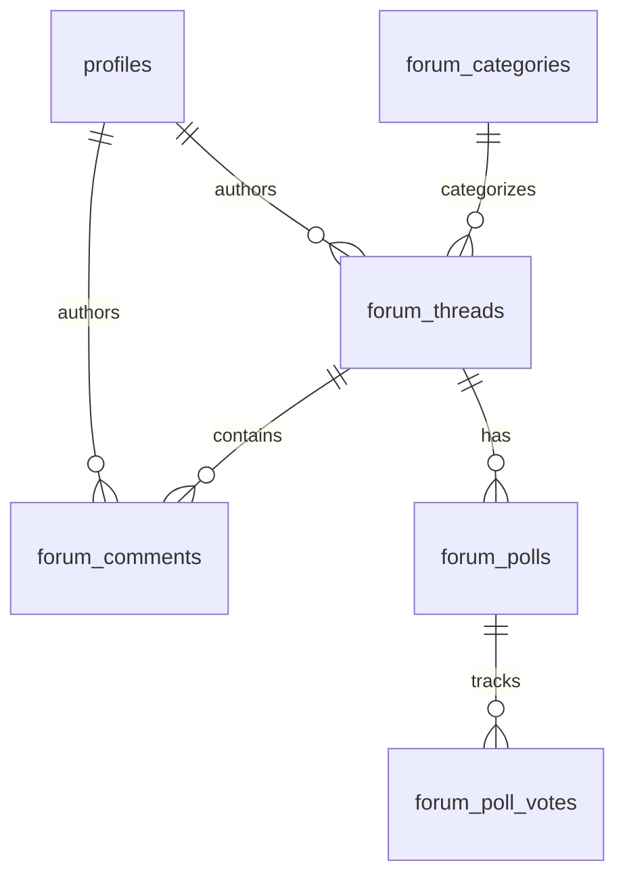

# Database Design & Data Model

## 1. Schema Overview
The database is normalized to 3NF for most entities, using **PostgreSQL** on Supabase.
- **Core Entities**: `profiles`, `forum_threads`, `forum_comments`.
- **Engagement**: `forum_likes`, `forum_polls` (JSONB hybrid), `forum_bookmarks`.
- **Moderation**: `forum_reports`, `admin_logs`, `category_moderators`.
- **Gamification**: `badges`, `user_badges`, `reputation_points`.

## 2. Issues & Critical Findings

### A. 🔴 CRITICAL: Poll Voting Race Condition
In `src/lib/forum.ts` -> `voteOnPoll`:
1.  The code fetches the poll (`select *`).
2.  It calculates new options JSON in JavaScript: `opt.votes + 1`.
3.  It updates the `forum_polls` row with the new JSON.

**The Issue**: If User A and User B vote at the same time:
-   Both read votes = 10.
-   Both compute votes = 11.
-   Both save.
-   **Result**: Votes = 11 (should be 12). One vote is lost.

**Fix**:
-   **Normalize Option Counts**: Don't store aggregate counts in JSON. `count(*)` from `forum_poll_votes` instead.
-   **OR Atomic Update**: Use a Postgres function to increment the specific key inside the JSONB, rather than replacing the whole object.

### B. 🟡 Missing Indexes (Performance Risk)
PostgreSQL does **not** automatically index Foreign Keys. The following columns are likely unindexed and will cause slow joins/filters as table grows:
-   `forum_threads(category)`
-   `forum_threads(author_id)`
-   `forum_comments(thread_id)`
-   `forum_comments(author_id)`
-   `forum_likes(thread_id, comment_id)`

### C. Type Safety
The application manual casts Supabase responses: `data as unknown as ForumThread[]`.
**Improvement**: generate TypeScript types from the schema (`supabase gen types`) and use them directly to prevent schema drift bugs.

## 3. Security (RLS)
RLS implementation is robust.
-   **Banned Users**: Insert policies explicitly check `is_banned = false`.
-   **Moderation**: Separate tables (`admin_logs`, `forum_reports`) restricted to `admin` / `super_admin`.
-   **Stewards**: `category_moderators` allow granular delegating of permissions (verified in `supabase_admin.sql` policies).
